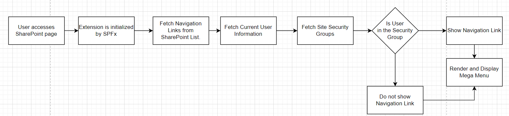
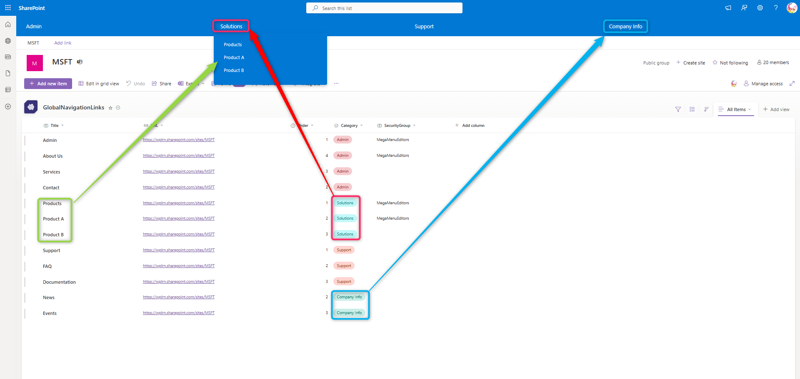

# SPFx Mega Menu for SharePoint Online

## 🚀 Overview

This project provides a custom SPFx (SharePoint Framework) mega menu extension for SharePoint Online. It dynamically fetches navigation links from a SharePoint list and displays them in a categorized mega menu, with role-based filtering using security groups.

## 📊 Flow Diagram

The following diagram illustrates the process flow for how the SPFx extension initializes and conditionally displays navigation links based on user group membership:



## 🛠️ Features

- **Dynamic Navigation**: Fetches links from a SharePoint list.
- **Role-Based Access**: Displays links based on user group membership.
- **Custom Styling**: Fully customizable with SCSS.
- **Mega Menu Layout**: Organizes links into categories for better usability.

## ⚙️ How It Works

1. **Extension Initialization**: The SPFx extension is triggered when a user accesses a SharePoint page.
2. **Data Fetching**:
   - Navigation links are fetched from the `GlobalNavigationLinks` SharePoint list.
   - Current user information and security group memberships are retrieved.
3. **Conditional Display**: Links are shown or hidden based on the user’s group membership.
4. **Rendering**: The mega menu is dynamically rendered and displayed.

## 📄 Prerequisites

- **SharePoint Online**
- **Node.js** and **npm**
- **PnP JS Library**

## 🚀 Installation

1. Clone the repository:
   ```bash
   git clone https://github.com/derejekitaw/spfx-mega-menu.git
   ```
2.  Install dependencies:

    ```bash
    npm install
    ```

3.  Build and deploy the solution:

    ```bash
    gulp bundle --ship
    gulp package-solution --ship
    ```

4.  Upload the `.sppkg` package to your SharePoint App Catalog.

💡 Usage
--------

Add the extension to your SharePoint site and configure the `manifest.json` properties for:

-   **Background Color**
-   **Text Color**
-   **Hover Color**
5. **Update Properties via the Site UI (Optional)**

Properties can be updated via the **SharePoint UI** or **PowerShell** without redeploying the package. For instance:

1.  **Using the Tenant-Wide Deployment**:

    -   Apply the extension globally and update properties using the Tenant-Wide Deployment list.
2.  **Using PowerShell**:

    ```powershell
    Set-PnPApplicationCustomizer -ClientSideComponentId <ComponentId> -Properties @{ "BackgroundColor" = "#ff0000"; "TextColor" = "#ffffff" }
    ```

* * * *

